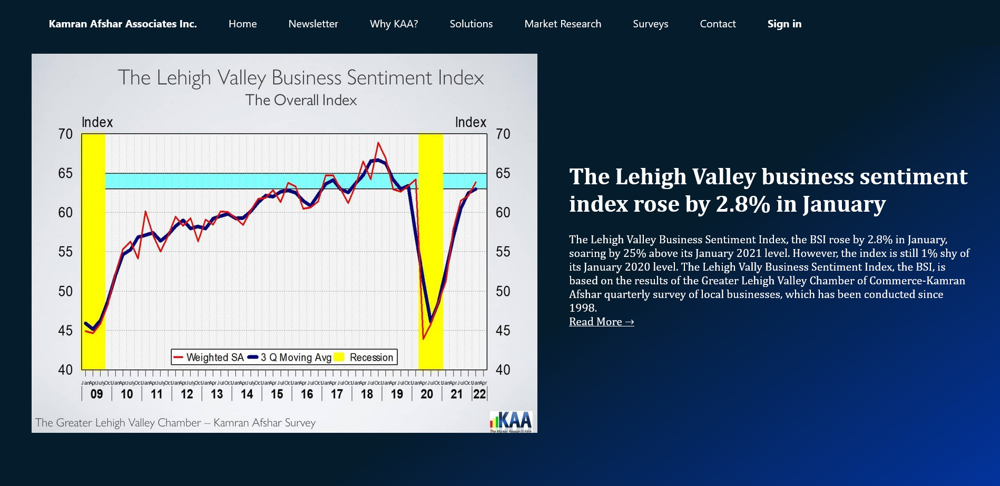
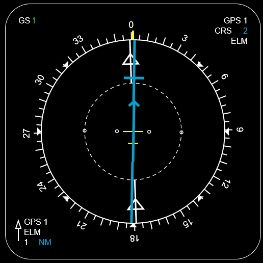
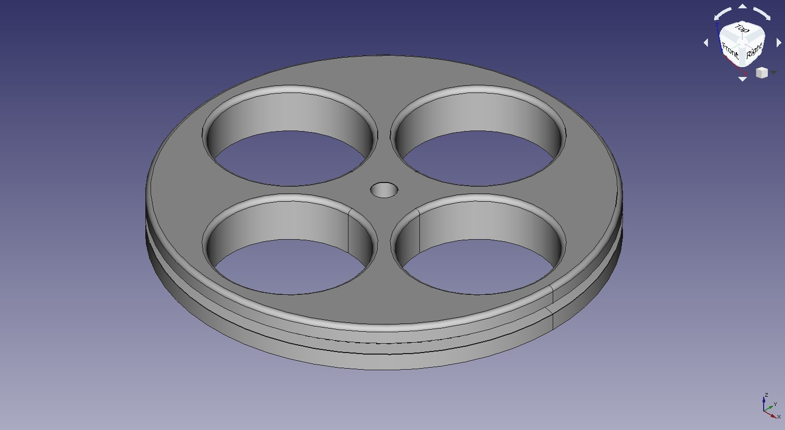
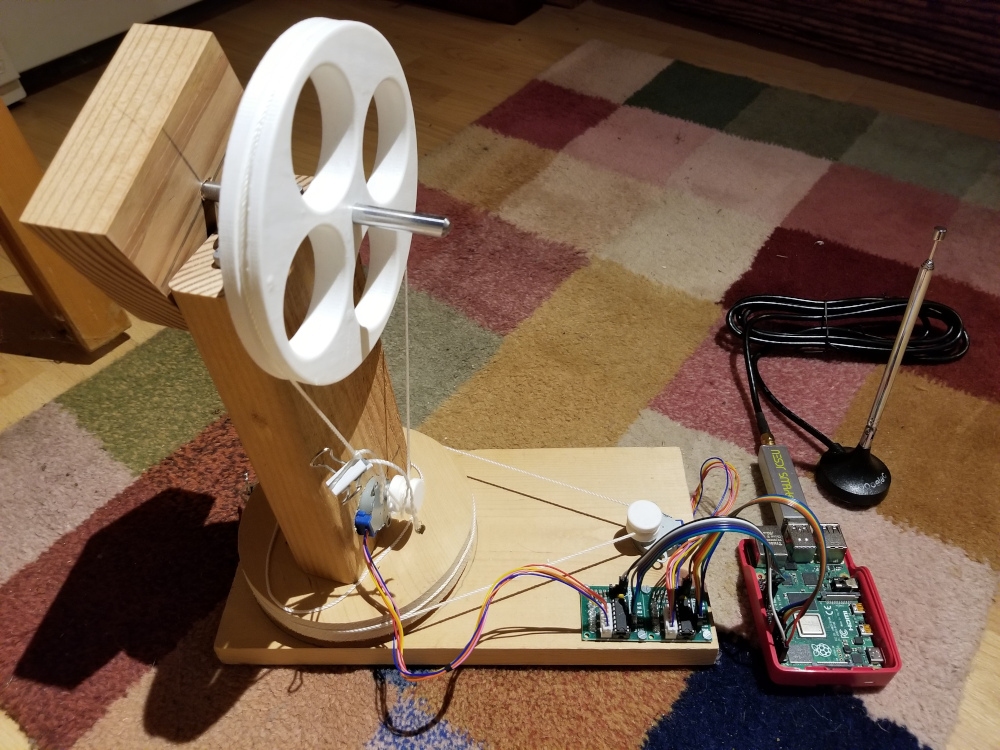

# Hi! My name is Chris LaRosa

I am a computer science major at DeSales University with a focus on cybersecurity, minoring in psychology, and graduating in May of 2022.

## Skills

Over the years I have accumulated experience in the following languages and platforms:

- Full-stack web development (both WAMP and LAMP stack)
- JavaScript (including ES6)
- PHP
- Java
- Python
- Bash
- Dart
- C++
- HTML5/CSS (including Canvas)
- Apache
- SQL
- Node.js
- React (including Next.js)
- React Native (including Expo)
- Flutter
- Android SDK
- Windows Powershell

I've also worked with the following cybersecurity tools (non-inclusive):

- Autopsy, EnCase, FTK, Cellebrite Forensics tools
- Wireshark, Nmap, Ettercap-ng Hacking tools

## Projects

I've amassed over a hundred both personal and academic projects because building stuff is fun!

Here's a showcase of just a few of them to give you an idea of what I do:

### Full-stack development of business website with newsletter from scratch:

### Virtual Horizontal Situation Indicator (HSI) written in HTML5 Canvas from scratch:

### CAD design of 3D printed pulley for use in Capstone Project created with FreeCAD:

### ADS-B Aircraft Tracking Apparatus using a Pi4, RTL-SDR, homebuilt pan-tilt assembly, and servo motors:

## Contact

Feel free to reach out! Here's my email:

> chris larosa *the number four* at gmail

Also check out my [LinkedIn page](https://linkedin.com/in/chris-larosa-8a943b231)
